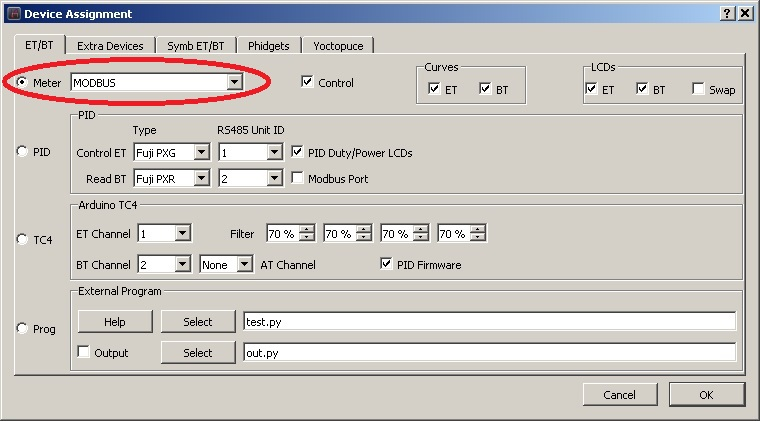
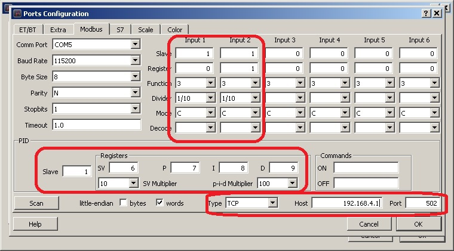
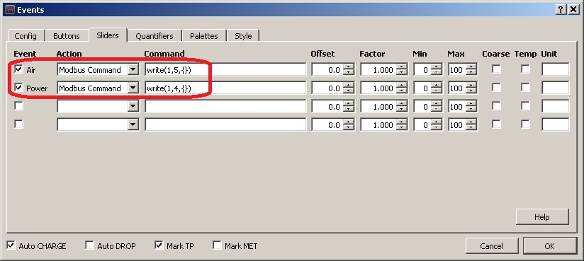

Launch Artisan, and select Device... from Config menu. The dialog below should appear, select ModBus as highlighted below:

Press OK, and the dialog below will appear:

Fill all highlighted areas with the values as in image. The meaning of various settings will be described below:
- Slave 1 - is the ModBus Slave device id of TC4ESP
- Input 1 and 2 are for the two main temperatures, ET (register 0) and BT(register 1) Input 3 and 4 and associated registers 2/3 are reserved for the other two temperatures, if all 4 channels are in use.
- function 3 - read holding register
- divide by 1/10 is required because ModBus send values as integers, 123.4 degrees are sent as 1234, and a division by 10 is required to scale the value correctly\
same for SV of PID
- Mode C or F - select your prefered temperature unit

PID operation also requires setting some registers, for SV and the three coeficients.\
Because PID coefficients can have very small values, under 0.1, a multiplication by 100 is used for same reason as above.

Last are to setup is for the Wifi parameters:
- select TCP from type dropdown
- input 192.168.4.1 as host (TCP4ESP board) IP address, and 502 as ModBus standard port.

Press OK to conclude this dialog

If the TC4ESP was been loaded with a sketch compiled with MODBUS_TCP option selected in user.hm then at start you should see the board IP as part of the splash screen\
If this happens, then you can start Artisan temperatures monitoring and see the values.

To activate the heater/fan controls, a further and last step is required, select Events... from same Config menu, then Sliders tab, and input the commands required for transmiting the sliders values to TC4ESP via ModBus registers 4 and 5, as in the image below.

If everyting was been done right, then you should be able to control heater/fan % using the associated slider in Artisan, and see the effect on TC4ESP display.
