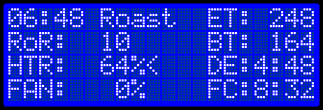

Operating TC4ESP
================

Because this architecture doesn't feature pots, due to ESP 8266 lack of enough ADC channels, the 4 buttons logic has been changed/improved, in order to replace the pots functionality, and also add new features.

In order to better understand the new UI, first we will meet the buttons layout and their meaning:

- up/down:\
control heater or fan, instead pot in manual mode. Using long press on up/down keys, when heater control is active, you can jump by 10 steps instead one by one;\
Up key short press, in Idle state only, will start preheat, for a setpoint value depending on beans processing: 170 C for naturals, 180 C for washed. 
This value can be changed during preheat using up/down keys.

- enter key:
short press toggle PID on-off in profile mode, or auto/manual modes, if no profile used;\
short press in Brown(ing) phase signals start of FC, and switch to Dev(elopment) phase, starting also DTR specific computations and display;\
Long press in idle/preheat/charge phases resets timer and start roast, or stop roast, in other roast phases.

- mode/settings key: 
in Idle phase switch to a completely new Settings screen, detailed in other document; you can find there profile browsing and choice, as for standard TC4;\
During roast acts as a toggle for UP/DOWN buttons target, switching between HTR and FAN. The "<" pointer near the HTR/FAN value serve as a visual hint of which output will be controlled by UP/DOWN buttons.

Buttons layout and their application codes, for the eBay buttons pad, are pictured below:

The new UI brings also significant display changes:
- hardware related: works on 20x4 I2C displays only
- the AT temperature area was been replaced by a roast phase/mode/virtual indicator. In that area you have a sequence of three groups of information, as follows:\
Roast phase: Idle, Preheat, Charge, Roast, TP, Drying, Brown, Dev and Cool;\
Mode: Profile #, or Man/Auto;\
Virtual mode: signals a new operation mode, where virtual temperatures are software generated, to simulate roasts without probes; main purpose is for testing;\
The reason of retiring AT temperature: missing sensor in ESP architecture, no more needed, because the TC dedicated amplifiers have have embeded CJC.
- the RoR value can be followed in some phases by underscore or "^" symbols, indicating RoR trending, i.e. sinking or raising;
- there is now a "<" sign near the HRT or FAN value, showing the target of UP/DOWN buttons control. This pointer can be moved with mode/settings button, during roast phases only;
- the lower right corner of display is used now for end of phase predictions, Artisan style, during non-profile roasts;\
The right half of row 3, hosts the DE prediction during Dry phase, or FC time and temperature, displayed alternately during Dev phase;\
The right half of row 4, hosts either the FC prediction during Brown phase, either displays alternately DTR time and percent, during Dev phase;\
Prediction temperatures are fixed in code, 150 C for DE, and 200 C for FC. If your machine has significant different values, for all bean origins, feel free to change them before compiling and loading, DE_TEMP and FC_TEMP, in raUser.h file.

